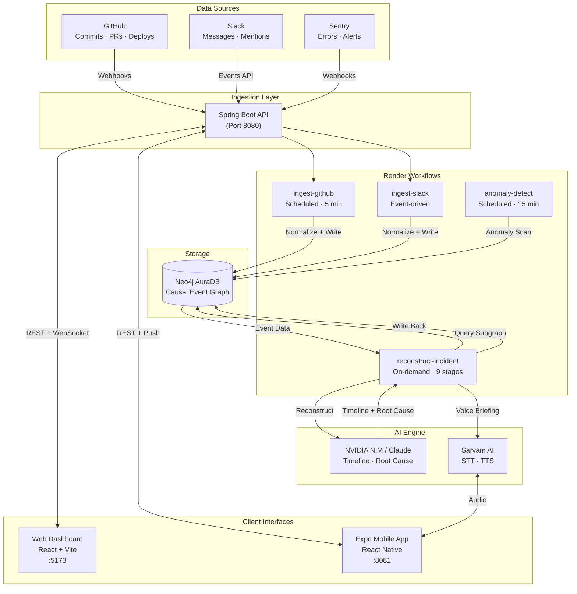
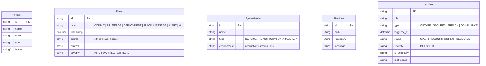
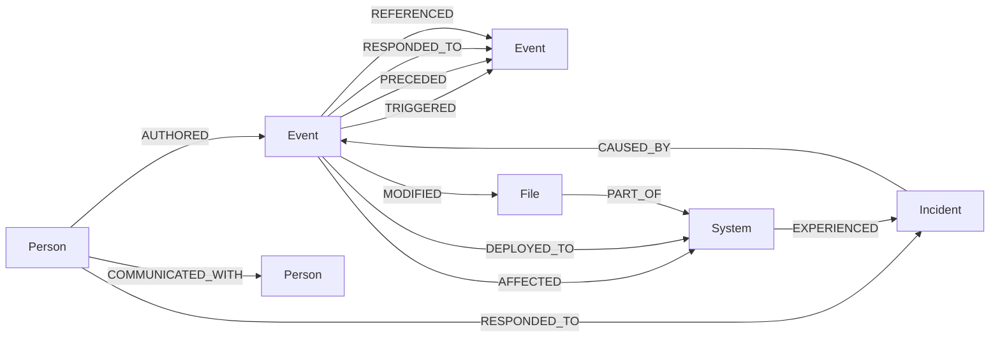
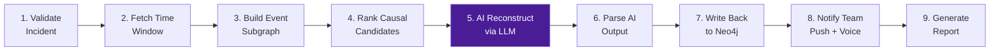
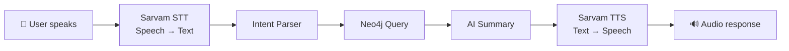

# Internet Black Box — Technical Documentation

> **The Aircraft Black Box for Software Teams**
> An always-on causal event graph that reconstructs the exact chain of events behind any software incident.

---

## Table of Contents

1. [Overview](#1-overview)
2. [System Architecture](#2-system-architecture)
3. [Technology Stack](#3-technology-stack)
4. [Project Structure](#4-project-structure)
5. [Neo4j Graph Data Model](#5-neo4j-graph-data-model)
6. [Backend — Spring Boot API](#6-backend--spring-boot-api)
7. [Web Dashboard — React + Vite](#7-web-dashboard--react--vite)
8. [Mobile App — Expo (React Native)](#8-mobile-app--expo-react-native)
9. [Render Workflows](#9-render-workflows)
10. [AI Reconstruction Engine](#10-ai-reconstruction-engine)
11. [Sarvam Voice Integration](#11-sarvam-voice-integration)
12. [API Reference](#12-api-reference)
13. [Environment Variables](#13-environment-variables)
14. [Local Development Setup](#14-local-development-setup)
15. [Deployment (Render)](#15-deployment-render)

---

## 1. Overview

### Problem

When production systems crash at 3 AM, engineers face a forensic nightmare. Logs tell you *what* broke, but never *why* — and never who was involved — without hours of manual reconstruction across Git, Slack, Sentry, and deployment pipelines.

| Tool | What It Misses |
|---|---|
| Git blame | Human context around code changes |
| Slack history | What decisions those conversations caused |
| Datadog / Sentry | The human actions that triggered the alerts |
| Post-mortems | Written from memory — biased, incomplete, slow |

### Solution

Internet Black Box passively captures webhook telemetry from GitHub, Slack, and Sentry, stores everything as a **causal property graph** in Neo4j AuraDB, and uses AI (NVIDIA NIM / Claude) to reconstruct incident timelines in seconds — delivered via web dashboard, mobile push, or multilingual voice briefing.

### Key Features

- ⚙️ **Passive Telemetry Webhooks** — GitHub, Slack, Sentry ingestion in real-time
- ⚡ **Neo4j Cypher Path-Finding** — Root cause traces in constant time via `shortestPath`
- 🎙️ **Sarvam Multilingual Voice** — Incident queries and briefings in English, Hindi, Tamil
- 📱 **Expo Mobile Client** — On-call alerts with timeline and voice query
- 🔒 **PII Redaction** — Security-first sanitization before graph injection

---

## 2. System Architecture

### High-Level Data Flow



### Incident Reconstruction Flow

```mermaid
sequenceDiagram
    actor Eng as On-Call Engineer
    participant App as Mobile / Web
    participant API as Spring Boot API
    participant Neo as Neo4j AuraDB
    participant AI as NVIDIA NIM
    participant Sarvam as Sarvam AI

    Eng->>App: Create P1 Incident
    App->>API: POST /api/incidents
    API->>Neo: Create Incident Node (RECONSTRUCTING)
    API->>API: Trigger reconstruct-incident

    rect rgb(30, 30, 60)
        Note over API,AI: 9-Stage Reconstruction Pipeline
        API->>Neo: Fetch events (4hr window)
        Neo-->>API: Subgraph JSON
        API->>API: Rank causal candidates
        API->>AI: Send subgraph + forensic prompt
        AI-->>API: Timeline + Root Cause + Prevention
        API->>Neo: Update Incident + CAUSED_BY edges
    end

    API->>Sarvam: Generate voice briefing (TTS)
    Sarvam-->>API: Audio file
    API->>App: Push notification + timeline
    App-->>Eng: 🚨 Alert with AI summary
```



---

## 3. Technology Stack

| Layer | Technology | Purpose |
|---|---|---|
| **Database** | Neo4j AuraDB | Causal graph storage + traversal |
| **Backend** | Spring Boot 3.3 (Java 17) | REST API, WebFlux, WebSocket |
| **Web Frontend** | React 19 + Vite + TypeScript | Dashboard UI |
| **Styling** | Tailwind CSS v4 | Utility-first CSS |
| **Mobile** | Expo (React Native) | Cross-platform on-call app |
| **AI / LLM** | NVIDIA NIM (LLaMA 3.1 70B) | Timeline reconstruction |
| **Voice** | Sarvam AI STT + TTS | Multilingual voice queries |
| **State** | Zustand | Client-side state (web + mobile) |
| **Charts** | Recharts | Dashboard visualizations |
| **Graph Viz** | Sigma.js | Interactive Neo4j subgraph rendering |
| **Hosting** | Render | Web Service + Static Site + Workers |

---

## 4. Project Structure

```
Internet Black Box/
├── backend/                    # Spring Boot Java application
│   ├── pom.xml                 # Maven dependencies
│   └── src/main/java/com/hackhazards/internetblackbox/
│       ├── InternetBlackBoxApplication.java
│       ├── config/             # CORS, WebClient configuration
│       ├── controller/         # REST endpoints
│       │   ├── IncidentController.java
│       │   ├── EventController.java
│       │   ├── QueryController.java
│       │   └── WebhookController.java
│       ├── dto/                # Data transfer objects
│       │   ├── IncidentDto.java
│       │   ├── EventDto.java
│       │   ├── GraphDto.java
│       │   ├── VoiceQueryRequest/Response.java
│       │   ├── nvidia/         # NVIDIA NIM DTOs
│       │   └── sarvam/         # Sarvam AI DTOs
│       ├── model/              # Neo4j node entities
│       │   ├── Person.java
│       │   ├── Event.java
│       │   ├── Incident.java
│       │   ├── SystemNode.java
│       │   └── FileNode.java
│       ├── repository/         # Spring Data Neo4j repositories
│       └── service/            # Business logic
│           ├── IncidentService.java
│           ├── IncidentReconstructionService.java
│           ├── QueryService.java
│           ├── WebhookService.java
│           ├── SarvamService.java
│           └── NvidiaLlmService.java
│
├── web-dashboard/              # React Vite frontend
│   ├── index.html
│   ├── public/
│   │   ├── logo.svg            # Project logo
│   │   └── favicon.svg         # Browser favicon
│   └── src/
│       ├── components/
│       │   ├── Sidebar.tsx      # Navigation + status panel
│       │   ├── GraphPanel.tsx   # Sigma.js graph visualization
│       │   ├── EventFeed.tsx    # Live event stream
│       │   └── MetricCard.tsx   # Dashboard stat cards
│       ├── pages/
│       │   ├── LandingPage.tsx  # Public landing page
│       │   ├── LoginPage.tsx    # Auth login
│       │   ├── RegisterPage.tsx # Auth registration
│       │   ├── Dashboard.tsx    # Main overview
│       │   ├── IncidentList.tsx # Incident table
│       │   └── IncidentDetail.tsx # Timeline + graph view
│       ├── store/
│       │   └── useDashboardStore.ts  # Zustand state
│       └── types/              # TypeScript interfaces
│
├── mobile-app/                 # Expo React Native application
│   ├── app.json                # Expo configuration
│   ├── app/
│   │   ├── _layout.tsx         # Root layout
│   │   ├── (tabs)/
│   │   │   ├── _layout.tsx     # Tab navigator
│   │   │   ├── index.tsx       # Incident feed
│   │   │   ├── voice.tsx       # Sarvam voice query
│   │   │   └── profile.tsx     # User profile
│   │   └── incident/
│   │       └── [id].tsx        # Incident detail (dynamic route)
│   ├── components/
│   │   ├── IncidentCard.tsx
│   │   ├── SeverityBadge.tsx
│   │   └── TimelineCard.tsx
│   ├── services/               # API client
│   ├── store/                  # Zustand mobile state
│   └── mock/                   # Mock data for development
│
├── render.yaml                 # Render deployment blueprint
├── start.sh                    # Local multi-service launcher
├── .env.example                # Environment variable template
└── DOCS.md                     # ← You are here
```

---

## 5. Neo4j Graph Data Model

### Node Types



### Relationship Types



### Core Cypher Queries

**Reconstruct incident timeline:**
```cypher
MATCH (i:Incident {id: $incidentId})
MATCH path = (i)<-[:CAUSED_BY*1..20]-(e:Event)
WITH e, path ORDER BY e.timestamp ASC
MATCH (e)<-[:AUTHORED]-(p:Person)
RETURN e.timestamp, e.type, e.content, p.name, e.source
```

**Root cause — shortest causal chain:**
```cypher
MATCH (i:Incident {id: $incidentId})
MATCH (first:Event {type: 'COMMIT'})
WHERE first.timestamp < i.triggered_at
MATCH path = shortestPath((first)-[:TRIGGERED|PRECEDED*]->(i))
RETURN path
```

**Impact blast radius:**
```cypher
MATCH (e:Event {id: $commitId})-[:TRIGGERED*1..10]->(affected:Event)
MATCH (affected)-[:AFFECTED]->(s:SystemNode)
RETURN DISTINCT s.name, s.environment, count(affected) as eventCount
ORDER BY eventCount DESC
```

**People involved (2hr window):**
```cypher
MATCH (i:Incident {id: $incidentId})
MATCH (e:Event)<-[:AUTHORED]-(p:Person)
WHERE e.timestamp > i.triggered_at - duration('PT2H')
  AND e.timestamp <= i.triggered_at
RETURN p.name, p.email, count(e) as eventCount, collect(e.type) as actions
ORDER BY eventCount DESC
```

---

## 6. Backend — Spring Boot API

### Package Structure

| Package | Responsibility |
|---|---|
| `controller` | REST endpoint handlers |
| `service` | Core business logic |
| `model` | Neo4j node entities (Spring Data Neo4j `@Node`) |
| `repository` | Spring Data Neo4j repository interfaces |
| `dto` | Request/response payloads |
| `config` | CORS, WebClient, security configuration |

### Controllers

| Controller | Base Path | Key Endpoints |
|---|---|---|
| `IncidentController` | `/api/incidents` | CRUD + reconstruction trigger |
| `EventController` | `/api/events` | Event query + filtering |
| `QueryController` | `/api/query` | Voice + text natural language queries |
| `WebhookController` | `/api/webhooks` | GitHub, Slack, Sentry receivers |

### Services

| Service | Purpose |
|---|---|
| `IncidentService` | Incident CRUD, status management |
| `IncidentReconstructionService` | 9-stage reconstruction pipeline |
| `WebhookService` | Webhook validation, event normalization |
| `QueryService` | Natural language → Cypher → AI summary |
| `NvidiaLlmService` | LLM API integration (NVIDIA NIM) |
| `SarvamService` | Speech-to-Text and Text-to-Speech |

---

## 7. Web Dashboard — React + Vite

### Pages

| Route | Page | Description |
|---|---|---|
| `/` | `LandingPage` | Public marketing page with feature showcase |
| `/login` | `LoginPage` | User authentication |
| `/register` | `RegisterPage` | User registration |
| `/dashboard` | `Dashboard` | Overview — metrics, event feed, anomaly alerts |
| `/incidents` | `IncidentList` | Filterable, sortable incident table |
| `/incidents/:id` | `IncidentDetail` | AI summary, timeline, causal graph, root cause |

### Key Components

| Component | Purpose |
|---|---|
| `Sidebar` | Navigation, system status indicators, user profile |
| `GraphPanel` | Interactive Neo4j subgraph rendered with Sigma.js |
| `EventFeed` | Live-updating stream of recent events |
| `MetricCard` | Dashboard statistic cards (MTTR, incident count, etc.) |

### State Management

All client state lives in a single Zustand store (`useDashboardStore.ts`) managing:
- Incidents, events, and selected incident
- WebSocket connection status
- Real-time mode toggle
- User authentication state

---

## 8. Mobile App — Expo (React Native)

### Screens

| Tab/Route | File | Description |
|---|---|---|
| Home | `app/(tabs)/index.tsx` | Incident feed — color-coded by severity |
| Voice | `app/(tabs)/voice.tsx` | Sarvam mic → STT → query → TTS response |
| Profile | `app/(tabs)/profile.tsx` | User settings + language preference |
| Detail | `app/incident/[id].tsx` | Timeline cards + root cause |

### Components

| Component | Purpose |
|---|---|
| `IncidentCard` | Incident list item with severity badge |
| `SeverityBadge` | P1 (red) / P2 (orange) / P3 (yellow) tag |
| `TimelineCard` | Single event in the reconstruction timeline |

---

## 9. Render Workflows

### Deployment Blueprint (`render.yaml`)

| Component | Service Type | Schedule |
|---|---|---|
| `api-server` | Web Service | Always-on |
| `web-dashboard` | Static Site | Build on push |
| `ingest-github` | Cron Job | Every 5 minutes |
| `reconstruct-incident` | Background Worker | On-demand |

### The 9-Stage Reconstruction Pipeline



| Stage | Action | Failure Behavior |
|---|---|---|
| 1. `validate-incident` | Confirm payload, set status `RECONSTRUCTING` | Halt |
| 2. `fetch-time-window` | Query Neo4j for 4hr event window | Retry 3× |
| 3. `build-event-subgraph` | `shortestPath` Cypher → JSON subgraph | Retry 3× |
| 4. `rank-causal-candidates` | Score paths by depth, severity, proximity | Continue |
| 5. `ai-reconstruct` | LLM generates timeline + root cause (10–30s) | Retry 2× |
| 6. `parse-ai-output` | Extract structured timeline, cause, prevention | Continue |
| 7. `write-back` | Update Incident node + `:CAUSED_BY` edges | Retry 3× |
| 8. `notify-team` | Push to Expo + Sarvam TTS voice briefing | Best-effort |
| 9. `generate-report` | Compile shareable incident report | Best-effort |

---

## 10. AI Reconstruction Engine

### Prompt Architecture

The reconstruction sends a structured prompt to the LLM:

```
SYSTEM: You are an expert incident investigator for software teams.
        You analyze sequences of digital events and reconstruct what
        happened during a software incident.

USER:   An incident occurred at [TIMESTAMP]: "[TITLE]"

        Below is a graph of all digital events from the 4 hours before
        and 30 minutes after this incident.

        EVENT GRAPH: [STRUCTURED JSON SUBGRAPH FROM NEO4J]

        Your task:
        1. Build a precise chronological timeline
        2. Identify the most likely root cause with evidence
        3. List all people involved and their role in the chain
        4. Propose 3 preventive measures
```

### Confidence Scoring

| Factor | Weight | Example |
|---|---|---|
| Temporal proximity | High | Events within 30 min score higher |
| Explicit references | Very high | Slack message mentioning a commit SHA |
| System overlap | Medium | Same file modified + same service crashed |
| Person overlap | Medium | Same person authored commit + discussed in Slack |

---

## 11. Sarvam Voice Integration

### Voice Query Pipeline



### Supported Languages

English, Hindi, Tamil, Telugu, Kannada, Malayalam, Bengali, Marathi

### API Endpoints Used

| Sarvam API | Purpose |
|---|---|
| `POST /speech-to-text` | Convert engineer's voice to query text |
| `POST /text-to-speech` | Read AI-generated timeline as audio |

---

## 12. API Reference

### Base URL

`http://localhost:8080/api` (local) · `https://api-server.onrender.com/api` (deployed)

### Incidents

| Method | Endpoint | Description |
|---|---|---|
| `POST` | `/incidents` | Create a new incident |
| `GET` | `/incidents` | List incidents (paginated) |
| `GET` | `/incidents/{id}` | Get incident with AI summary |
| `POST` | `/incidents/{id}/reconstruct` | Trigger AI reconstruction |
| `GET` | `/incidents/{id}/timeline` | Get ordered event timeline |
| `GET` | `/incidents/{id}/graph` | Get Neo4j subgraph as JSON |

### Events

| Method | Endpoint | Description |
|---|---|---|
| `GET` | `/events` | Query events (filter by time, type, source) |
| `GET` | `/events/{id}` | Get single event with context |

### Queries

| Method | Endpoint | Description |
|---|---|---|
| `POST` | `/query/voice` | Process voice query (audio → answer) |
| `POST` | `/query/text` | Process text query (NL → answer) |

### Voice Query Request

```json
{
  "audioBase64": "base64-encoded-audio-string",
  "languageCode": "en-IN"
}
```

### Voice Query Response

```json
{
  "transcript": "What happened to the payment service?",
  "answer": "At 2:47 PM, Sarah merged a PR that modified auth middleware...",
  "audioBase64": "base64-encoded-tts-response"
}
```

### Webhooks

| Method | Endpoint | Description |
|---|---|---|
| `POST` | `/webhooks/github` | GitHub webhook receiver |
| `POST` | `/webhooks/slack` | Slack Events API receiver |
| `POST` | `/webhooks/sentry` | Sentry webhook receiver |

---

## 13. Environment Variables

Copy `.env.example` to `.env` and fill in your credentials:

| Variable | Required | Description |
|---|---|---|
| `SPRING_NEO4J_URI` | ✅ | Neo4j AuraDB connection URI |
| `SPRING_NEO4J_USERNAME` | ✅ | Neo4j username (default: `neo4j`) |
| `SPRING_NEO4J_PASSWORD` | ✅ | Neo4j password |
| `NVIDIA_API_KEY` | ✅ | NVIDIA NIM API key for LLM |
| `NVIDIA_MODEL` | ✅ | Model ID (default: `meta/llama-3.1-70b-instruct`) |
| `SARVAM_API_KEY` | ✅ | Sarvam AI subscription key |
| `GITHUB_PERSONAL_ACCESS_TOKEN` | Optional | For GitHub ingestion |
| `GITHUB_CLIENT_ID` | Optional | GitHub OAuth client ID |
| `GITHUB_CLIENT_SECRET` | Optional | GitHub OAuth client secret |
| `SLACK_BOT_TOKEN` | Optional | Slack Bot token for monitoring |
| `SLACK_SIGNING_SECRET` | Optional | Slack webhook signature verification |
| `SENTRY_DSN` | Optional | Sentry error tracking DSN |
| `SENTRY_AUTH_TOKEN` | Optional | Sentry API auth token |
| `JWT_SECRET` | ✅ | 256-bit key for JWT session signing |
| `PORT` | — | Backend port (default: `8080`) |

---

## 14. Local Development Setup

### Prerequisites

- Java 17 (JDK)
- Node.js 18+ & npm
- Maven 3.8+
- Neo4j AuraDB account (or local Neo4j via Docker)
- API keys: NVIDIA NIM, Sarvam AI

### Quick Start (All Services)

```bash
# Clone and enter project
git clone <repo-url>
cd "Internet Black Box"

# Configure environment
cp .env.example .env
# Edit .env with your credentials

# Launch everything
chmod +x start.sh
./start.sh
```

### Individual Services

**Backend (Spring Boot):**
```bash
cd backend
mvn clean spring-boot:run
# → http://localhost:8080
```

**Web Dashboard (React):**
```bash
cd web-dashboard
npm install
npm run dev
# → http://localhost:5173
```

**Mobile App (Expo):**
```bash
cd mobile-app
npm install
npx expo start --web
# → http://localhost:8081
```

---

## 15. Deployment (Render)

The project includes a `render.yaml` blueprint for one-click deployment to Render:

| Service | Type | Build |
|---|---|---|
| `api-server` | Web Service (Docker) | Maven build |
| `web-dashboard` | Static Site | `npm run build` |
| `ingest-github` | Cron Job | Every 5 min |
| `reconstruct-incident` | Background Worker | Java JAR |

### Deploy Steps

1. Push code to GitHub
2. Connect repo to Render
3. Render auto-detects `render.yaml`
4. Set environment variables in Render dashboard
5. Deploy — zero-downtime on `main` branch pushes

---

*Built by Team Arete for HACKHAZARDS '26*
