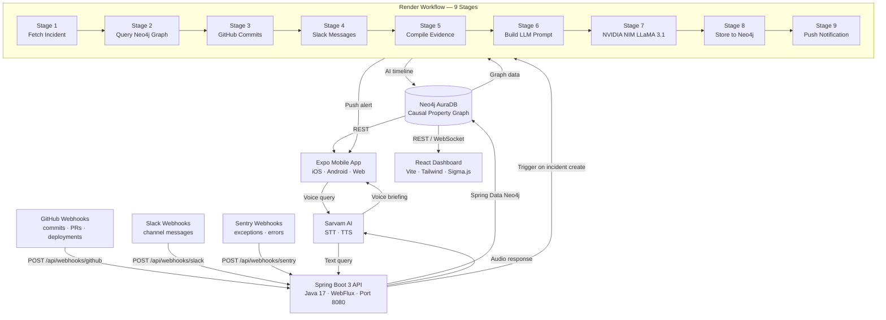
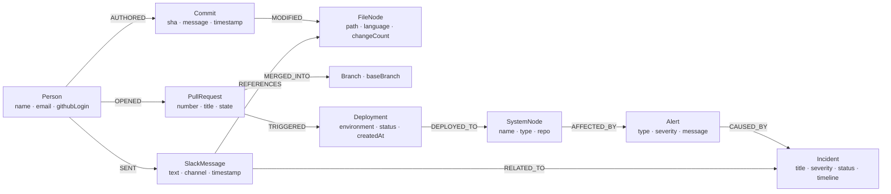
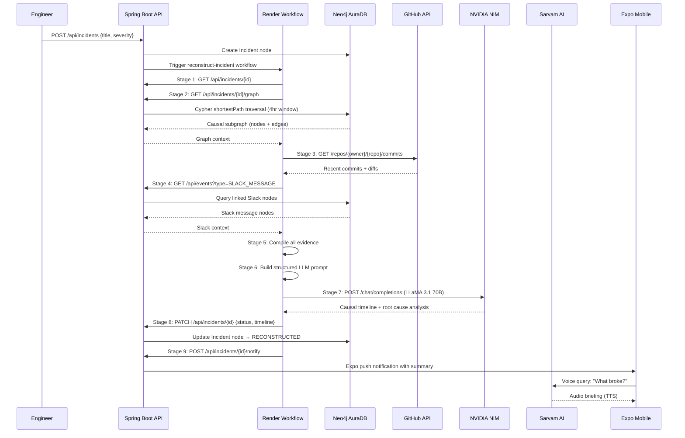

# 🚀 Internet Black Box

> **The Aircraft Black Box for Software Teams** — passively mapping git, communications, and telemetry into an always-on, AI-powered causal incident reconstructor.

*Team Arete · HackHazards '26*

---

## 📌 Problem & Domain

Every software team loses significant time every week to one question: **"What happened?"**

A production outage takes down a service for 4 hours. The post-mortem meeting has 8 engineers staring at logs with no clear root cause. Git blame shows *what* changed, Slack shows *who* was talking, Sentry shows *what* broke — but **no tool connects the dots**. Engineers become forensic archaeologists manually cross-referencing timestamps across a dozen isolated tools.

**The numbers are brutal:**
- ⏱ Average MTTR (Mean Time to Resolution): **4.2 hours**
- 💸 Average cost of 1 hour of cloud production downtime: **$300,000**
- 📋 Average post-mortem completion time: **2–5 days**
- 🔄 Root cause found in first tool examined: **less than 20% of incidents**

Internet Black Box eliminates this by building a **unified causal property graph** that links every commit, message, deployment, and alert together — so when something breaks, you traverse the graph instead of digging through rubble.

**Themes Selected:**
- [x] Developer Tools & Software Infrastructure  
- [x] Trust, Identity & Security  
- [x] Work, Finance & Digital Economy  

---

## 🎯 Objective

- **Target Users**: On-call engineers, SREs, Tech Leads, and Incident Responders
- **The Pain Point**: High MTTR caused by fragmented, siloed information during outages
- **Value Provided**: Automatic causal timeline reconstruction — cutting diagnostic latency from **hours to seconds**

---

## 🧠 Team & Approach

### Team Name: `Team Arete`

### Team Members:
- [Nayana Shaji Mekkunnel](https://www.linkedin.com/in/nayana-shaji-394124320)
- [Gabriel James](https://www.linkedin.com/in/gabrieljamesamara)
- [Jany Sabarinath](https://www.linkedin.com/in/jany-sabarinath-b38192317)
- [Vrindha P](https://www.linkedin.com/in/vrindha-p)

### Our Approach:
- **Why this problem**: We wanted to address the mental strain and operational cost of developer on-call shifts. Standard tools store data in flat temporal silos, leaving human operators to stitch references together manually.
- **Key Challenges**: Linking unstructured chat text (Slack messages) to structured entities (Git commit SHAs) and parsing high-throughput webhooks under 100ms latency.
- **Breakthrough**: Modeling causality as a directed graph in Neo4j. By utilizing index-free adjacency path-finding, we run constant-time Cypher queries that trace outages directly back to PR authors — entirely bypassing expensive SQL JOIN performance bottlenecks.

---

## 🏆 Sponsored Tracks

- [x] **Neo4j Track** – AuraDB as the causal graph database core
- [x] **Render Track** – Render Workflows for the 9-stage AI reconstruction pipeline
- [x] **Expo Track** – Expo mobile client for on-call voice triage
- [x] **Sarvam Track** – Multilingual voice-powered incident intelligence

---

## 🏗️ System Architecture

### High-Level Data Flow



### Neo4j Graph Data Model



### Incident Reconstruction Sequence



---

## 🔄 Render Workflows — Deep Dive

### Why Render Workflows?

The 9-stage incident reconstruction is a **long-running, distributed background task** (10–45 seconds). It cannot run on the request thread (timeout) or as a simple cron job. Render Workflows provides:

- ✅ **Durable execution** — tasks survive restarts and temporary failures
- ✅ **Built-in retries** — each stage independently retries with configurable backoff
- ✅ **Observability** — full execution logs per task visible in the dashboard
- ✅ **Parallel scaling** — multiple incidents can reconstruct simultaneously
- ✅ **Timeout isolation** — each stage has its own timeout, preventing cascading failures

### The 9-Stage Pipeline (`workflow/workflow.py`)

| Stage | Task Name | Timeout | Retries | What It Does |
|---|---|---|---|---|
| 1 | `stage-1-fetch-incident` | 30s | 3× (1s backoff) | Load the incident record from the Spring Boot API |
| 2 | `stage-2-fetch-causal-graph` | 60s | 3× (2s backoff ×2) | Execute Cypher `shortestPath` across a 4-hour temporal Neo4j subgraph |
| 3 | `stage-3-fetch-github-commits` | 60s | 3× (1s backoff) | Pull the 15 most recent commits for all repos referenced in the causal graph |
| 4 | `stage-4-fetch-slack-messages` | 30s | 2× (1s backoff) | Retrieve Slack messages linked to the incident from Neo4j event nodes |
| 5 | `stage-5-compile-evidence` | 30s | 2× (500ms backoff) | Structure all evidence (graph, commits, Slack) into a coherent JSON context |
| 6 | `stage-6-build-prompt` | 20s | 2× (500ms backoff) | Construct the structured NVIDIA NIM prompt with all evidence sections |
| 7 | `stage-7-call-nvidia-nim` | 120s | 3× (5s backoff ×2) | Call LLaMA 3.1 70B via NVIDIA NIM for root-cause synthesis |
| 8 | `stage-8-store-result` | 30s | 3× (2s backoff) | Persist the AI-generated timeline back to Neo4j via the API |
| 9 | `stage-9-notify-team` | 20s | 2× (1s backoff) | Trigger Expo push notification to on-call engineers |

### Workflow Code Sample

```python
from render_sdk import Workflows, Retry

app = Workflows()

@app.task(
    name="stage-7-call-nvidia-nim",
    retry=Retry(max_retries=3, wait_duration_ms=5000, backoff_scaling=2.0),
    timeout_seconds=120,
    plan="free",
)
def call_nvidia_nim(data: dict) -> dict:
    """Stage 7: Call NVIDIA NIM LLaMA 3.1 70B for AI timeline synthesis."""
    with httpx.Client(timeout=90) as client:
        resp = client.post(
            "https://integrate.api.nvidia.com/v1/chat/completions",
            headers={"Authorization": f"Bearer {NVIDIA_API_KEY}"},
            json={"model": "meta/llama-3.1-70b-instruct", "messages": [...], "max_tokens": 1024}
        )
        timeline = resp.json()["choices"][0]["message"]["content"]
    return {**data, "ai_timeline": timeline}

# Orchestrator chains all 9 stages
@app.task(name="reconstruct-incident", timeout_seconds=600, plan="free")
def reconstruct_incident(incident_id: str) -> dict:
    data = fetch_incident(incident_id)       # Stage 1
    data = fetch_causal_graph(data)          # Stage 2
    data = fetch_github_commits(data)        # Stage 3
    data = fetch_slack_messages(data)        # Stage 4
    data = compile_evidence(data)            # Stage 5
    data = build_prompt(data)               # Stage 6
    data = call_nvidia_nim(data)            # Stage 7
    data = store_result(data)               # Stage 8
    return notify_team(data)               # Stage 9
```

### Deploying the Workflow

1. Render Dashboard → **New → Workflow**
2. Connect your GitHub repo
3. Set file path: `workflow/workflow.py`
4. Add env vars: `API_SERVER_URL`, `NVIDIA_API_KEY`, `GITHUB_PERSONAL_ACCESS_TOKEN`, `SARVAM_API_KEY`

---

## 🗄️ Neo4j AuraDB — Deep Dive

### Why a Graph Database?

Traditional relational databases store incidents as flat rows. To trace *why* a payment service went down, you'd need:

```sql
-- SQL: 5 JOINs, full table scans, O(n log n)
SELECT c.sha, c.message, p.name
FROM commits c
JOIN pull_requests pr ON c.pr_id = pr.id
JOIN deployments d ON pr.id = d.pr_id
JOIN alerts a ON d.service = a.service
JOIN incidents i ON a.incident_id = i.id
WHERE i.id = ?;
```

With Neo4j's index-free adjacency, this becomes a **constant-time graph traversal**:

```cypher
// Cypher: traverses edges directly, O(1) per hop
MATCH (i:Incident {id: $id})
MATCH path = shortestPath(
  (c:Event {type: 'COMMIT'})
  -[:TRIGGERED|PRECEDED*1..6]->
  (i)
)
RETURN nodes(path), relationships(path)
```

### Node Types & Properties

| Node Label | Key Properties | Description |
|---|---|---|
| `Person` | `name`, `email`, `githubLogin`, `slackUserId` | Developer or team member |
| `Event` | `type`, `source`, `description`, `timestamp`, `sha` | Any tracked event (commit, message, alert) |
| `Incident` | `title`, `severity`, `status`, `timeline`, `createdAt` | Production incident record |
| `FileNode` | `path`, `language`, `repoName`, `changeCount` | Source file modified in a commit |
| `SystemNode` | `name`, `type`, `repoOwner`, `repoName`, `environment` | Deployed system or service |

### Edge (Relationship) Types

| Relationship | From → To | Meaning |
|---|---|---|
| `:AUTHORED` | Person → Event(COMMIT) | Developer pushed this commit |
| `:OPENED` | Person → Event(PR) | Developer opened this PR |
| `:MERGED` | Event(PR) → Event(DEPLOY) | PR merge triggered a deployment |
| `:DEPLOYED_TO` | Event(DEPLOY) → SystemNode | Deployment targeted this system |
| `:TRIGGERED` | Event(DEPLOY) → Event(ALERT) | Deployment triggered this alert |
| `:CAUSED_BY` | Incident → Event | This event contributed to the incident |
| `:AFFECTED` | SystemNode → Incident | System was affected by the incident |
| `:MODIFIED` | Event(COMMIT) → FileNode | Commit changed this file |
| `:SENT` | Person → Event(SLACK) | Person sent this Slack message |
| `:REFERENCES` | Event(SLACK) → FileNode | Slack message mentioned this file |

### Spring Data Neo4j Integration

```java
// Entity mapping example
@Node("Incident")
public class Incident {
    @Id @GeneratedValue private String id;
    private String title;
    private IncidentSeverity severity;
    private IncidentStatus status;
    private String timeline;  // AI-generated reconstruction

    @Relationship(type = "CAUSED_BY")
    private List<Event> causingEvents;

    @Relationship(type = "AFFECTED")
    private List<SystemNode> affectedSystems;
}

// Repository with custom Cypher
@Repository
public interface IncidentRepository extends Neo4jRepository<Incident, String> {
    @Query("MATCH (i:Incident {id: $id}) " +
           "MATCH path = shortestPath((e:Event)-[:TRIGGERED|PRECEDED*1..6]->(i)) " +
           "RETURN path")
    List<Path> findCausalPath(@Param("id") String incidentId);
}
```

---

## 🤖 NVIDIA NIM — AI Root-Cause Synthesis

### Model Used
**LLaMA 3.1 70B Instruct** via NVIDIA NIM API (`meta/llama-3.1-70b-instruct`)

### Why LLaMA 3.1 70B?
- 70 billion parameters — sufficient reasoning depth for multi-document causality analysis
- Instruction-tuned for structured, technical output
- NVIDIA NIM provides low-latency inference endpoints with guaranteed SLAs

### Prompt Engineering

The Stage 6 workflow task builds a structured prompt from:
1. **Incident metadata** — title, severity, affected systems, timestamp
2. **Neo4j causal chain** — up to 15 edges from the temporal subgraph
3. **GitHub commits** — last 10 commits with SHA, author, message, date
4. **Slack context** — up to 10 messages with author and text

The LLM returns a structured 5-section analysis:
1. **Root Cause** — specific commit/deployment identified
2. **Causal Chain** — step-by-step event sequence
3. **Affected Scope** — systems and users impacted
4. **Immediate Action** — single most important remediation step
5. **Prevention** — concrete architectural change to prevent recurrence

### API Configuration

```java
// NvidiaLlmService.java
nvidia.api.key=${NVIDIA_API_KEY:}
nvidia.model=${NVIDIA_MODEL:meta/llama-3.1-70b-instruct}
```

```python
# Render Workflow — Stage 7
resp = client.post(
    "https://integrate.api.nvidia.com/v1/chat/completions",
    json={
        "model": "meta/llama-3.1-70b-instruct",
        "messages": [system_msg, user_msg],
        "max_tokens": 1024,
        "temperature": 0.2  # Low temp for factual, consistent output
    }
)
```

---

## 🎙️ Sarvam AI — Multilingual Voice Intelligence

### Why Sarvam AI?

Sarvam AI is an Indian AI company building multilingual LLMs and voice APIs optimized for Indian languages. For Internet Black Box, this enables on-call engineers to interact with the system in their native language without keyboard access.

### Features Integrated

#### Speech-to-Text (STT)
Engineers speak a query on the Expo mobile app:
> *"What broke on the payment service last night?"*

Sarvam STT converts this to structured text, which is routed to the Spring Boot API as a natural language incident query.

**API Usage:**
```java
// SarvamService.java
@PostMapping("/api/voice/query")
public VoiceQueryResponse handleVoiceQuery(@RequestBody VoiceQueryRequest request) {
    // 1. Send audio to Sarvam STT
    String queryText = sarvamService.transcribe(request.getAudioBase64());
    // 2. Parse and route to Neo4j query
    TextQueryResponse result = queryService.processTextQuery(queryText);
    // 3. Send result text to Sarvam TTS
    byte[] audioResponse = sarvamService.synthesize(result.getSummary());
    return new VoiceQueryResponse(audioResponse, result);
}
```

#### Text-to-Speech (TTS)
After reconstruction, the AI-generated timeline is synthesized into:
- **English** — for international teams
- **Hindi** — for Indian on-call engineers

This audio briefing plays automatically on the Expo app when a push notification is tapped — zero reading required for triage at 3 AM.

### Environment Configuration

```properties
sarvam.api.key=${SARVAM_API_KEY:}
```

---

## 🔗 Webhook Integrations

### GitHub Webhook (`POST /api/webhooks/github`)

Receives and processes:
- **push** events → creates `Event(COMMIT)` nodes for each commit, linked to `Person` (author)
- **pull_request** events (opened, merged, closed) → creates `Event(PR)` nodes
- **deployment** events → creates `Event(DEPLOY)` nodes linked to `SystemNode`

All webhook payloads pass through the **PII redaction pipeline** before Neo4j writes — stripping API keys, secrets, and passwords from commit messages and PR descriptions.

### Slack Webhook (`POST /api/webhooks/slack`)

Receives Slack Events API payloads:
- `message` events → creates `Event(SLACK_MESSAGE)` nodes linked to `Person` (Slack user)
- URL verification challenge handled automatically
- File mentions in messages → creates `:REFERENCES` edges to `FileNode`

### Sentry Webhook (`POST /api/webhooks/sentry`)

Receives Sentry webhook events:
- Exception alerts → creates `Event(ALERT)` nodes linked to `SystemNode`
- Severity levels mapped to `IncidentSeverity` enum
- High-severity alerts can auto-trigger incident creation

---

## 📱 Expo Mobile App — Deep Dive

### Architecture

The mobile app is built with **Expo Router** (file-based routing, same mental model as Next.js) and provides:

```
mobile-app/app/
├── (tabs)/
│   ├── index.tsx        # Home — live incident feed
│   ├── timeline.tsx     # Causal graph timeline viewer
│   └── settings.tsx     # Integration config
├── incident/
│   └── [id].tsx         # Incident detail + voice query
└── _layout.tsx          # Root layout with Expo navigation
```

### Key Screens

| Screen | Purpose |
|---|---|
| **Home / Feed** | Real-time list of incidents sorted by severity and recency |
| **Incident Detail** | Full AI-generated timeline, causal path, affected systems |
| **Voice Query** | Sarvam STT mic input → Neo4j traversal → Sarvam TTS audio response |
| **Causal Graph** | Visual graph of the Neo4j subgraph for the incident |
| **Settings** | Connect GitHub, Slack, Sentry integrations |

### Push Notifications

When Stage 9 of the Render Workflow fires, it calls `POST /api/incidents/{id}/notify`, which sends an Expo push notification to registered devices containing:
- Incident title and severity
- First 200 chars of the AI-generated root cause
- Deep link to the incident detail screen

---

## 🌐 React Web Dashboard — Deep Dive

### Stack

- **React 19** with TypeScript
- **Vite 8** for build and HMR
- **Tailwind CSS v4** for utility-first styling
- **Zustand** for global state management
- **Recharts** for metrics and timelines
- **Sigma.js** for interactive Neo4j graph visualization
- **Lucide React** for icons

### Sigma.js Graph Visualization

The causal graph is rendered as an interactive force-directed graph:

```typescript
// Node color coding
const NODE_COLORS = {
  Person:    "#3B82F6",  // Blue
  Event:     "#F59E0B",  // Amber
  SystemNode:"#EF4444",  // Red
  Incident:  "#F97316",  // Orange
  FileNode:  "#10B981",  // Emerald
};
```

Users can:
- **Hover** nodes to see full properties
- **Click** to highlight causal paths
- **Drag** to explore the graph layout
- **Zoom** into dense subgraphs

---

## 🛠️ Backend API Reference

### Base URL
```
Local:      http://localhost:8080
Production: https://api-server-xxxx.onrender.com
```

### Endpoints

| Method | Path | Description |
|---|---|---|
| `GET` | `/actuator/health` | Health check (used by Render) |
| `GET` | `/api/incidents` | List all incidents |
| `POST` | `/api/incidents` | Create a new incident (triggers workflow) |
| `GET` | `/api/incidents/{id}` | Get incident by ID |
| `PATCH` | `/api/incidents/{id}` | Update incident status/timeline |
| `GET` | `/api/incidents/{id}/graph` | Get Neo4j causal subgraph for incident |
| `POST` | `/api/incidents/{id}/notify` | Send push notification for incident |
| `GET` | `/api/events` | List events (filterable by type, incidentId) |
| `POST` | `/api/query/text` | Natural language text query against Neo4j |
| `POST` | `/api/voice/query` | Voice query (audio → STT → Neo4j → TTS → audio) |
| `POST` | `/api/webhooks/github` | GitHub webhook receiver |
| `POST` | `/api/webhooks/slack` | Slack webhook receiver |
| `POST` | `/api/webhooks/sentry` | Sentry webhook receiver |

### Example: Create Incident

```bash
curl -X POST https://api-server-xxxx.onrender.com/api/incidents \
  -H "Content-Type: application/json" \
  -d '{
    "title": "Payment service 500s",
    "severity": "CRITICAL",
    "type": "SERVICE_OUTAGE",
    "affectedSystem": "payment-api"
  }'
```

Response triggers the 9-stage Render Workflow automatically.

---

## 🛠️ Full Tech Stack

### Backend
| Technology | Version | Purpose |
|---|---|---|
| Java | 17 (LTS) | Runtime |
| Spring Boot | 3.3.0 | Application framework |
| Spring WebFlux | 6.x | Reactive HTTP client (non-blocking external calls) |
| Spring Data Neo4j | 7.x | Neo4j OGM repository layer |
| Lombok | latest | Boilerplate reduction |
| Maven | 3.9 | Build tool |

### Frontend
| Technology | Version | Purpose |
|---|---|---|
| React | 19 | UI framework |
| TypeScript | 5.x | Type safety |
| Vite | 8 | Build tool + dev server |
| Tailwind CSS | v4 | Utility-first styling |
| Sigma.js | 3.x | Graph canvas visualization |
| Zustand | 5.x | Lightweight state management |
| Recharts | 2.x | Metrics charts |

### Mobile
| Technology | Version | Purpose |
|---|---|---|
| Expo SDK | 52 | React Native framework |
| Expo Router | 4.x | File-based navigation |
| Expo Notifications | latest | Push notifications |
| React Native | 0.76 | Native mobile runtime |

### Infrastructure
| Technology | Purpose |
|---|---|
| Neo4j AuraDB | Graph database — causal event store |
| Render Web Service | Spring Boot API hosting (Docker) |
| Render Static Site | React dashboard hosting |
| Render Workflow | 9-stage AI reconstruction pipeline |
| NVIDIA NIM | LLM inference (LLaMA 3.1 70B) |
| Sarvam AI | Multilingual STT + TTS |
| GitHub API | Commit and PR data ingestion |
| Slack Events API | Real-time message ingestion |
| Sentry Webhooks | Exception alert ingestion |

---

## 🔒 Security — PII Redaction Pipeline

Before any webhook payload is written to Neo4j, all data passes through a sanitization pipeline that:

1. **Pattern matching** — Regex scrubs for common secret patterns (AWS keys, GitHub tokens, JWT tokens, passwords)
2. **Key-value scanning** — Removes values for sensitive keys (`secret`, `password`, `key`, `token`, `auth`)
3. **Commit message cleaning** — Strips accidentally committed credential strings
4. **Slack message filtering** — Removes phone numbers, email addresses, and SSN-like patterns

This ensures the causal graph is a forensic evidence store, not a secret exfiltration vector.

---

## ✨ Key Features

- ⚙️ **Passive Telemetry Webhooks** — Captures GitHub merges, Slack threads, and Sentry alerts automatically
- ⚡ **Neo4j Cypher Path-Finding** — `shortestPath` traversals trace root causes in constant time
- 🔄 **Render Workflow Orchestration** — 9-stage durable pipeline with independent retries per stage
- 🤖 **AI Incident Reconstruction** — LLaMA 3.1 70B synthesizes causal timelines from graph context
- 🎙️ **Sarvam Multilingual Voice** — STT + TTS in English and Hindi for hands-free triage
- 📱 **Expo Mobile Client** — On-call incident feed, voice queries, and push alerts
- 🔒 **PII Redaction Pipeline** — Security-first sanitization before every Neo4j write
- 📊 **Sigma.js Causal Graph** — Interactive visualization of Neo4j subgraphs with color-coded node types

---

## 📽️ Demo & Deliverables

- **Demo Video Link (Mandatory):** [YouTube Demo Video](https://youtu.be/5RN4Sodz3bo)
- **Deployment Link (Recommended):** [https://web-dashboard-y5zl.onrender.com](https://web-dashboard-y5zl.onrender.com)
- **Pitch Deck / PPT (Highly Recommended):** [presentation.pptx](./presentation.pptx)

---

## 📸 Screenshots


---

## ✅ Tasks & Bonus Checklist

- [x] All team members completed the mandatory social task
- [x] Render Workflow with multiple connected stages implemented
- [x] Neo4j AuraDB as primary causal database
- [x] Sarvam AI STT + TTS integrated
- [x] Expo mobile app with push notifications
- [x] PII redaction pipeline
- [x] Full technical documentation in [DOCS.md](./DOCS.md)

---

## 🧪 How to Run the Project

### Requirements
- Java 17+ (JDK)
- Node.js 18+ & npm
- Maven 3.8+
- Neo4j AuraDB account — [console.neo4j.io](https://console.neo4j.io)
- NVIDIA NIM API key — [build.nvidia.com](https://build.nvidia.com)
- Sarvam AI API key — [app.sarvam.ai](https://app.sarvam.ai)

### Quick Start (All Services)

```bash
# 1. Clone the repository
git clone https://github.com/gabsgj/Internet-Black-Box.git
cd "Internet Black Box"

# 2. Configure environment
cp .env.example .env
# Edit .env with your Neo4j, NVIDIA, Sarvam, GitHub, and Slack credentials

# 3. Start everything
chmod +x start.sh
./start.sh
# → Opens http://localhost:5173 (Web Dashboard)
```

### Individual Services

```bash
# Backend API (Spring Boot) → http://localhost:8080
cd backend && mvn clean spring-boot:run

# Web Dashboard (React + Vite) → http://localhost:5173
cd web-dashboard && npm install && npm run dev

# Mobile App (Expo) → scan QR with Expo Go
cd mobile-app && npm install && npx expo start

# Render Workflow (local test)
cd workflow && pip install -r requirements.txt
render workflows init --language python
```

### Environment Variables

| Variable | Required | Description |
|---|---|---|
| `SPRING_NEO4J_URI` | ✅ | Neo4j AuraDB Bolt URI |
| `SPRING_NEO4J_USERNAME` | ✅ | Neo4j username |
| `SPRING_NEO4J_PASSWORD` | ✅ | Neo4j password |
| `NVIDIA_API_KEY` | ✅ | NVIDIA NIM API key |
| `SARVAM_API_KEY` | ✅ | Sarvam AI API key |
| `GITHUB_PERSONAL_ACCESS_TOKEN` | ✅ | GitHub PAT (repo + read:org scopes) |
| `SLACK_BOT_TOKEN` | ✅ | Slack Bot OAuth token |
| `SLACK_SIGNING_SECRET` | ✅ | Slack app signing secret |
| `SENTRY_DSN` | ⬜ | Sentry webhook DSN (optional) |
| `USE_MOCK_DATA` | ⬜ | Set `true` to bypass live APIs in dev |

### Deploying to Render

1. Push to GitHub
2. Render Dashboard → **New → Blueprint** → connect repo (reads `render.yaml`)
3. Fill env vars → **Apply** → wait ~5-8 min
4. Register webhooks at your deployed API URL
5. Render Dashboard → **New → Workflow** → connect repo → set path `workflow/workflow.py`

> See [deployment_guide.md](./DOCS.md) for detailed deployment instructions.

---

## 📖 Full Technical Documentation

For complete end-to-end documentation including:
- Full API reference with request/response schemas
- Neo4j data model with example queries
- Architecture decision records
- Render deployment guide

See **[DOCS.md](./DOCS.md)**

---

## 🧬 Future Scope

- 📈 **More Integrations** — Datadog metrics, AWS CloudTrail, GCP audit logs, Kubernetes events
- 🛡️ **Security Enhancements** — WORM storage on Neo4j for tamper-proof compliance
- 🌐 **Expanded Voice Support** — Tamil, Telugu, Kannada, Bengali via Sarvam
- 🔄 **Anomaly Detection** — Proactive reconstruction when event patterns deviate from baseline
- 🤝 **Collaborative Triage** — Shared incident war-room with real-time collaborative annotations on the causal graph

---

## 📎 Resources & Credits

- **Neo4j AuraDB** — [neo4j.com/cloud/auradb](https://neo4j.com/cloud/platform/auradb/)
- **Sarvam AI** — [sarvam.ai](https://sarvam.ai) — multilingual Indian language AI
- **NVIDIA NIM** — [build.nvidia.com](https://build.nvidia.com) — LLaMA 3.1 70B inference
- **Render Workflows** — [render.com/docs/workflows](https://render.com/docs/workflows) — durable task orchestration
- **Expo** — [expo.dev](https://expo.dev) — React Native framework
- **Sigma.js** — [sigmajs.org](https://www.sigmajs.org) — graph visualization
- **Spring Data Neo4j** — [docs.spring.io](https://docs.spring.io/spring-data/neo4j) — Neo4j OGM

---

## 🏁 Final Words

Building a multi-dimensional causal database and voice-based forensic assistant under hackathon constraints was an incredible experience. The moment we watched a single `shortestPath` Cypher query trace an outage back through a Slack conversation, a Git commit, and a deployment — in under 50ms — we knew we'd built something meaningful.

The Render Workflow architecture made the AI reconstruction pipeline genuinely reliable — with per-stage retries, independent timeouts, and full execution observability. Neo4j's index-free adjacency turned what would have been a 5-table SQL join nightmare into a single-line Cypher traversal. Sarvam AI made the entire thing accessible without a screen.

**When something goes wrong at 3 AM, you don't piece together 11 tools. You ask the Black Box.**

---

*Team Arete — HackHazards '26*
